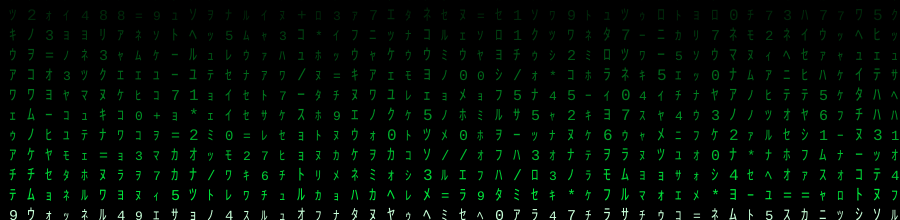

<div align="center">


<!-- Custom digital-rain banner. Lives at assets/matrix-rain.svg in this repo — GitHub renders it fine as a relative image path. -->


</div>

<p align="center">
  
  
  
  
  
  
</p>
<p align="center">
  
  
  
  
  
  
  
</p>

> Two badges above have no official icon in the badge library yet — CrewAI and AutoGen got a `▲` / `◆` glyph instead of a logo, and Hermes got `λ`, so they stay visually consistent with the terminal theme rather than sitting there as plain text.

---


```
> Runs an AI automation agency shipping agentic systems + GaaS
  (Generative-AI-as-a-Service) for education & coaching businesses.

> Building SAAVIBUDDY — my own enterprise AI stack & product line.

> Multi-agent orchestration (CrewAI, AutoGen) · Advanced RAG
  (KG-RAG, Corrective RAG, Self-RAG, Fusion RAG) · LLMOps ·
  fine-tuning (LoRA/QLoRA) · guardrails (Llama Guard, NeMo).

> Background in digital marketing & high-ticket sales — I don't
  just build the agent, I know why a business should pay for it.

> Vibe coder by method: I own the architecture and the outcome,
  AI tools handle the keystrokes.
```

---


<div align="center">
<!-- Custom terminal boot animation. Lives at assets/terminal-glitch.svg in this repo. -->

</div>

---


<div align="center">
<!-- Self-hosted glitch text. Lives at assets/saavibuddy-glitch.svg in this repo. -->

</div>

- 🧠 **[SAAVIBUDDY](https://saavibuddy.space)** — my enterprise AI stack: infra, live agent demos, and a growing product suite, shipped with React + Vite + Tailwind + FastAPI.
- 🤖 Production agentic workflows for coaching & education clients — CRM-integrated AI workforces, not just chatbots.
- 🧪 Constantly stress-testing RAG architectures and guardrail stacks before they touch a client's data.

---


<div align="center">

</div>

> Swap `YOUR-GITHUB-USERNAME` (5 spots above) for your real GitHub handle or the cards will render empty.

---

Drop this as `.github/workflows/snake.yml` in a repo to get an animated snake eating your contribution graph, auto-updated daily:


markdown


---

<p align="center">
  <a href="https://saavibuddy.space"></a>
  <a href="https://linkedin.com/in/aswin-s-1a3026346"></a>
  <a href="https://x.com/aswinofcl"></a>
</p>


</div>
