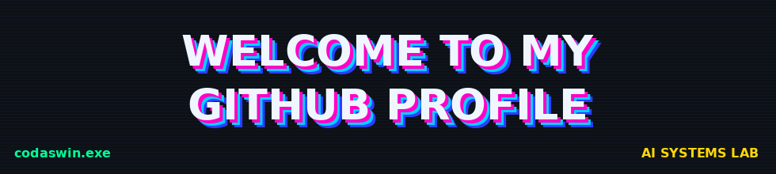
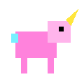
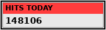
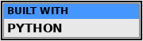
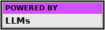
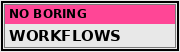

  

<b>AI builder • agent tinkerer • automation addict • open-source enjoyer</b>

  

&nbsp;&nbsp;&nbsp;
<code>STATUS: ONLINE</code>
&nbsp;&nbsp;&nbsp;

  

aswin@github:~$ whoami

AI builder.
I like agents that do work,
automations that remove boring tasks,
and open-source projects that are actually useful.

aswin@github:~$ currently_building

> AI agents
> agentic workflows
> automation systems
> LLM apps
> weird little experiments that may become products

✦ featured builds ✦

<table>
<tr>
<td width="50%" valign="top">

💬 modaicom

LinkedIn comment assistant that reads context and helps generate better replies without staring at the comment box for 10 minutes.

chrome extension LLMs context-aware

</td>

<td width="50%" valign="top">

🤖 AI LinkedIn Manager

An open-source AI system where multiple agents help research, write, engage, and manage LinkedIn workflows.

multi-agent automation desktop AI

</td>
</tr>

<tr>
<td width="50%" valign="top">

🧠 Sales Coach CRAG

A local-first sales assistant combining retrieval, knowledge search, and intelligent fallback.

RAG local LLMs sales intelligence

</td>

<td width="50%" valign="top">

🧪 everything else

Agent experiments, RAG systems, automation tools, desktop apps, and things I probably started because I said:

“what if AI did this automatically?”

Browse all repositories →

</td>
</tr>
</table>

 

aswin@github:~$ cat stack.txt

AI / AGENTS   → Python · RAG · LLM orchestration · multi-agent systems
BACKEND       → FastAPI · PostgreSQL · Redis · APIs
FRONTEND      → React · TypeScript · JavaScript
INFRA         → Docker · Linux · VPS
WORKFLOW      → Git · GitHub · VS Code

aswin@github:~$ philosophy

01. understand the problem
02. automate the boring part
03. keep humans where judgment matters
04. ship before overthinking
05. break it
06. fix it
07. repeat

CURRENT SYSTEM STATUS

builder ................. ONLINE
curiosity ............... MAX
agents .................. RUNNING
manual repetitive work .. TARGET ACQUIRED
finished forever ........ impossible

 

  

somewhere else on the internet

LinkedIn
  •  
GitHub

  

best viewed with curiosity enabled. 
this profile is permanently under construction.

  

connection established.
waiting for next build...
█

<!--
  YOU FOUND THE SOURCE EASTER EGG.

  Achievement unlocked:
  "viewed README.md instead of just scrolling"

  reward: absolutely nothing.
-->
